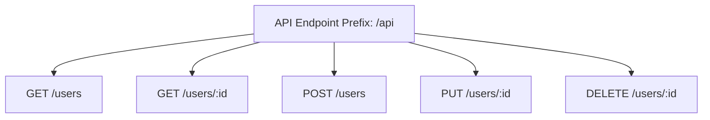

### Especificação Funcional - Sistema de Gestão de Usuários com Node.js

---

#### 1. Introdução:
Este documento detalha a funcionalidade principal do sistema de gestão de usuários construído em Node.js usando express como framework HTTP. O sistema foi projetado para oferecer uma API REST que permite a manipulação de dados de usuários, incluindo operações como visualização, criação, atualização e remoção.

---

#### 2. Funcionalidades Principais:
1. **Inicialização do Servidor:**
   - O servidor é inicializado com o uso do framework Express.js.
   - Porta configurada automaticamente utilizando a variável de ambiente `PORT`, ou a porta padrão `3000`.

2. **Recurso "Usuário":**
   - O sistema implementa um recurso chamado "Usuário".
   - Os dados do usuário são armazenados localmente em memória como um array, no formato definido por um modelo `User`.
   - Permite realizar as seguintes ações:
     - **Listar Usuários:** Retorna a lista de todos os usuários cadastrados.
     - **Buscar Usuário por ID:** Retorna os detalhes de um usuário específico.
     - **Criar Usuário:** Adiciona um novo usuário no sistema.
     - **Atualizar Usuário:** Atualiza os dados de um usuário com base em seu ID.
     - **Excluir Usuário:** Apaga o registro de um usuário.

---

#### 3. Estrutura da Aplicação:
- **src/app.ts:**
  - Ponto de entrada para inicializar o servidor HTTP.
  - Configura middlewares essenciais como a conversão de requisição para JSON.
  - Define que todas as rotas da API são acessíveis com o prefixo `/api`.

- **src/models/userModel.ts:**
  - Define a interface `User` com os seguintes atributos:
    - `id: string`: Identificador único do usuário.
    - `name: string`: Nome do usuário.
    - `email: string`: Email do usuário.

- **src/controllers/userController.ts:**
  - Contém as implementações das funções responsáveis por manipular os dados dos usuários.
    - `getUsers`: Listar todos os usuários.
    - `getUserById`: Retorna um usuário específico pelo `id`.
    - `createUser`: Adiciona um novo usuário ao sistema.
    - `updateUser`: Atualiza os dados de um usuário existente.
    - `deleteUser`: Remove um usuário pelo `id`.

- **src/routes.ts:**
  - Define as rotas da API e associa cada rota a um método implementado no controlador.

---

#### 4. Requisitos Funcionais:
1. **Inicialização do Servidor:**
   - Deve iniciar na porta configurada na variável de ambiente ou na porta padrão (3000).
   - Deve exibir a mensagem `Server is running on port <PORT>` no console ao iniciar.

2. **Listar Usuários (`GET /api/users`):**
   - Retornar um array de todos os usuários cadastrados.
   - Resposta:
     - Código HTTP 200 (OK), com os usuários como payload JSON.

3. **Buscar Usuário por ID (`GET /api/users/:id`):**
   - Retornar os dados de um usuário específico.
   - Cenários:
     - Se o ID existe:
       - Código HTTP 200 (OK), com o usuário encontrado como payload JSON.
     - Se o ID não existe:
       - Código HTTP 404 (Not Found) com a mensagem: `"User not found"`.

4. **Criar Usuário (`POST /api/users`):**
   - Adicionar um novo usuário ao sistema.
   - Solicitação deve conter os atributos `name` e `email`.
   - Cenários:
     - Se algum campo obrigatório faltar:
       - Código HTTP 400 (Bad Request), com a mensagem: `"Name and email are required"`.
     - Caso o sucesso na criação:
       - Código HTTP 201 (Created), com o usuário criado como payload JSON.

5. **Atualizar Usuário (`PUT /api/users/:id`):**
   - Atualizar informações de um usuário específico baseado no ID.
   - Solicitação deve incluir os novos valores para os campos `name` e/ou `email`.
   - Cenários:
     - Se o ID existe:
       - Código HTTP 200 (OK), com o usuário atualizado como payload JSON.
     - Se o ID não existe:
       - Código HTTP 404 (Not Found), com a mensagem: `"User not found"`.

6. **Excluir Usuário (`DELETE /api/users/:id`):**
   - Remover um usuário específico baseado no ID.
   - Cenários:
     - Se o ID existe:
       - Código HTTP 204 (No Content), sem payload.
     - Se o ID não existe:
       - Código HTTP 404 (Not Found), com a mensagem: `"User not found"`.

---

#### 5. Diagrama de Arquitetura:
##### Fluxo Geral da Aplicação:
```mermaid
graph TD
    A[app.ts] --> B[routes.ts]
    B --> C[Controllers]
    C --> D[getUsers()]
    C --> E[getUserById()]
    C --> F[createUser()]
    C --> G[updateUser()]
    C --> H[deleteUser()]
    D --> I[User Model]
    E --> I[User Model]
    F --> I[User Model]
    G --> I[User Model]
    H --> I[User Model]
```

---

#### 6. Diagrama de Rotas:
##### Rotas disponíveis na API:


---

#### 7. Considerações Gerais:
- O sistema utiliza armazenamento em memória através de um array local. Ele não possui persistência em banco de dados.
- Para produção, recomenda-se que o armazenamento local seja substituído por um banco de dados para evitar perda de dados entre reinícios do servidor.
- A aplicação está preparada para ser ampliada ou adaptada conforme necessidade.

---

#### 8. Melhoria Proposta:
- Adicionar validações mais robustas para os dados de entrada.
- Usar bibliotecas para gerenciamento de ID, como UUID, ao invés de criar o ID baseado no comprimento do array.
- Implementar o armazenamento em banco de dados para persistência de dados.

--- 

Esta especificação funcional está projetada para representar as funcionalidades providas e como elas se conectam, garantindo fidelidade ao código fornecido.